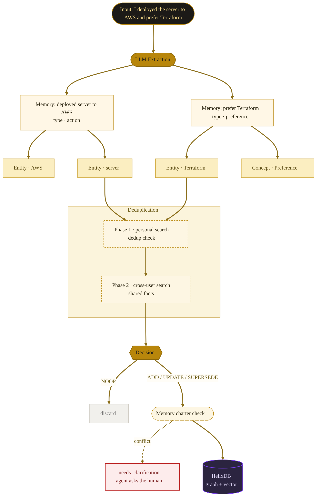
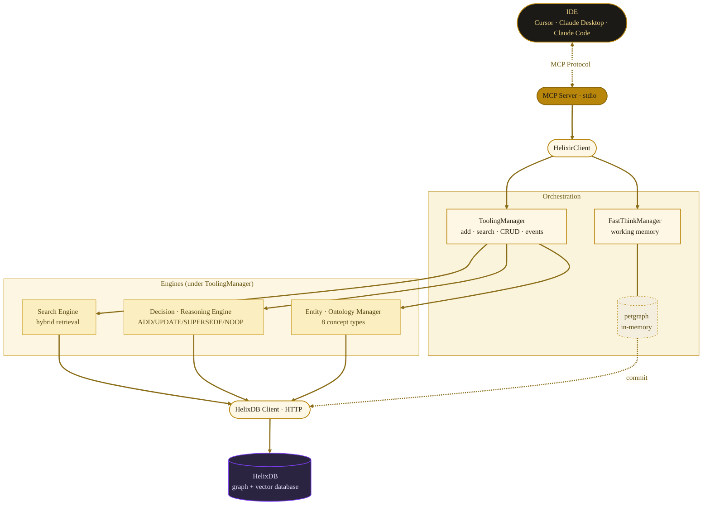
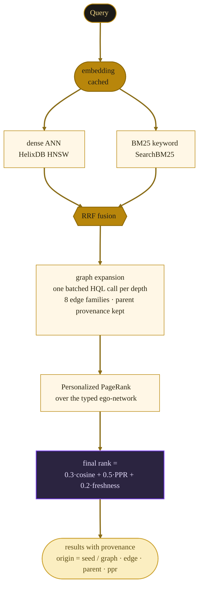
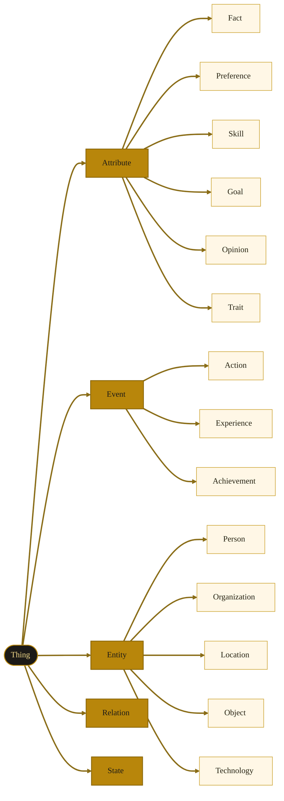

<p align="center">
  
</p>

<h1 align="center">Helixir</h1>

<p align="center">
  An elder brain for LLM agents: memory that never forgets,<br/>
  reasons in chains, and sees connections others can't.
</p>

<p align="center">
  <b><a href="#quick-start">⚡ Quick Start</a></b> &middot;
  <a href="#what-is-helixir">What is Helixir?</a> &middot;
  <a href="#contents">Contents</a>
</p>

<p align="center">
  
  
  
  
</p>

---

## Contents

- [What is Helixir?](#what-is-helixir)
- [Philosophy](#philosophy)
- [**Quick Start**](#quick-start)
  - [One-command install](#one-command-install)
  - [Prerequisites](#prerequisites)
- [How It Works](#how-it-works)
  - [Read path (zero LLM calls)](#read-path-zero-llm-calls)
  - [Architecture](#architecture)
- [Ontology](#ontology)
- [Graph Schema](#graph-schema)
- [MCP Tools](#mcp-tools)
- [Integration](#integration) — Cursor, Claude Desktop
- [Configuration](#configuration)
- [Development](#development)
- [Upgrading](UPGRADING.md) — v0.3.x → v0.4.0 migration

---

## What is Helixir?

Helixir gives AI agents **memory that persists between sessions** — and more than that: memory that *reasons*. When an agent starts a new conversation, it recalls past decisions, preferences, goals and the **chains of reasoning behind them**, not a flat log of similar text.

Every input is LLM-extracted into atomic facts, classified by ontology (8 types), linked to entities and to other facts by typed logical edges (`BECAUSE`, `IMPLIES`, `CONTRADICTS`, `SUPPORTS`), and stored in one graph+vector engine. Retrieval is a hybrid of dense vectors, BM25 keyword search and graph traversal ranked by Personalized PageRank — with **zero LLM calls on the read path**, so it is exactly as fast on a local ollama model as on a cloud API.

Built on [HelixDB](https://github.com/HelixDB/helix-db) (graph + vector database) with native [MCP](https://modelcontextprotocol.io/) support for Cursor, Claude Desktop, Claude Code and any MCP-compatible client.

| Plain RAG memory | Helixir |
|:-----------------|:--------|
| Returns similar text chunks | Returns facts **with provenance**: what matched directly, what was pulled through which edge, and why |
| Append-only — grows forever | Curated writes: ADD / UPDATE / SUPERSEDE / NOOP decided per fact |
| No reasoning trail | Causal chains: *A because B*, *A implies C* — and `connect_memories(A, B)` finds the path between any two concepts |
| LLM in the retrieval loop | Read path is LLM-free: ~15–30 ms warm searches, fully local |
| Single-user silo | Shared graph: one fact, many knowers, consensus ranking, conflict detection |
| Silent overwrites | Memory charter: conflicting writes escalate to the agent as questions |

## Philosophy

Three principles drive every design decision; the long version lives in [`helixir/doc/design-rationale.md`](helixir/doc/design-rationale.md).

**An elder brain forgets nothing.** There is deliberately **no delete tool**. Outdated facts are superseded — the old version stays in history (`HAS_HISTORY` edges, `valid_until`), reachable forever. Why? Because the value of memory is not in single facts but in long chains between them: *Rajasthan weather → guar harvest → guar gum price → fracking costs → shale stocks*. A memory that prunes "irrelevant" facts destroys the middle of chains it cannot yet see. Time affects **attention** (what surfaces first), never **reachability** (what can be found through connections).

**The writer pays, the reader flies.** All expensive work — extraction, dedup decisions, relation inference — happens at write time. Reading is pure math over precomputed structure: no LLM, no re-embedding when warm. This is what makes a fully local setup (ollama + HelixDB) practical.

**The memory does not gaslight its owner.** Writes that conflict with what is already known — a reversed preference, a contradiction, anything destructive — are not resolved silently. They come back in `add_memory.needs_clarification` as ready-to-ask questions, governed by a human-editable [memory charter](helixir/memory-charter.md): a constitution of rules the engine may never override.

---

## Quick Start

### One-command install

```bash
curl -fsSL https://raw.githubusercontent.com/nikita-rulenko/Helixir/main/install.sh | bash
```

The script will:
1. Check prerequisites (Rust, Docker)
2. Clone the repo and build from source
3. Start HelixDB via Docker
4. Deploy the graph schema
5. Generate MCP config for your IDE

Or install manually:

```bash
git clone https://github.com/nikita-rulenko/Helixir.git
cd helixir

make build          # Build release binary
make setup          # Start HelixDB + deploy schema
make config         # Print MCP config to paste into your IDE
```

### Prerequisites

- **Rust 1.85+** — [rustup.rs](https://rustup.rs)
- **Docker** — for HelixDB ([install](https://docs.docker.com/get-docker/))
- **API key** — at least one LLM provider:
  - [Cerebras](https://cloud.cerebras.ai) (free tier, ~3000 tok/s)
  - [OpenAI](https://platform.openai.com/api-keys)
  - [Ollama](https://ollama.com) (local, no key needed)

---

## How It Works



### Architecture



### Read path (zero LLM calls)



Warm search: p50 ≈ 15–30 ms. Reasoning chains and `connect_memories` run on the same machinery — the read path works identically with no LLM configured at all.

---

## Ontology

Every memory is classified into one of **8 concept types**. The LLM extractor assigns the type during ingestion; `search_by_concept` retrieves memories by type.

| Type | What it captures | Example |
|:-----|:-----------------|:--------|
| **fact** | Objective knowledge, statements about the world | "Rust compiles to native code" |
| **preference** | Likes, dislikes, tastes, favorites | "I prefer dark mode in all editors" |
| **skill** | Abilities, competencies, expertise | "I can write fluent Python" |
| **goal** | Plans, aspirations, objectives | "I want to learn Japanese this year" |
| **opinion** | Subjective beliefs, judgments, viewpoints | "I think remote work is more productive" |
| **experience** | Past events, situations lived through | "I lived in Berlin for 3 years" |
| **achievement** | Accomplished milestones, completed goals | "I built a working compiler from scratch" |
| **action** | Specific tasks performed, operations executed | "I deployed the CI/CD pipeline yesterday" |

### Ontology hierarchy

The concept types are organized into a tree stored in HelixDB:



The hierarchy enables traversal: searching for "Attribute" returns all facts, preferences, skills, goals, and opinions. Entity types (Person, Organization, etc.) are used for extracted named entities.

---

## Graph Schema

Helixir stores everything as a typed graph: **15 node types** connected by **33 edge types**.

### Node types

| Node | Purpose | Key fields |
|:-----|:--------|:-----------|
| **Memory** | Core unit — one atomic fact | content, memory_type, certainty, importance, user_id |
| **User** | Owner of memories | user_id, name |
| **Entity** | Named thing extracted from text | name, entity_type, aliases |
| **Concept** | Ontology node (Fact, Skill, Goal...) | name, level, parent_id |
| **Context** | Situational scope (work, personal...) | name, context_type |
| **Session** | Conversation session | session_id, status |
| **Agent** | AI agent that created a memory | agent_id, role, capabilities |
| **HistoryEvent** | Audit log entry for a memory | action, old_value, new_value, timestamp |
| **MemoryChunk** | Fragment of a long memory | content, position, token_count |
| **Reasoning** | Reasoning node | reasoning_type, confidence |
| **Constraint** | Rule applied in a context | rule, constraint_type, priority |
| **MemoryEmbedding** | Vector embedding (search index) | content, created_at |
| **EntityEmbedding** | Vector embedding for entity search | name |
| **DocPage / DocChunk / CodeExample / ErrorCode** | Documentation pipeline (reserved) | — |

### Edge types (active)

These 24 edge types are used in the current pipeline:

| Edge | From → To | What it means |
|:-----|:----------|:--------------|
| **HAS_MEMORY** | User → Memory | User owns this memory |
| **INSTANCE_OF** | Memory → Concept | Memory is of this ontology type |
| **BELONGS_TO_CATEGORY** | Memory → Concept | Memory belongs to this category |
| **MENTIONS** | Memory → Entity | Memory mentions this entity |
| **EXTRACTED_ENTITY** | Memory → Entity | Entity was LLM-extracted from this memory |
| **RELATES_TO** | Entity → Entity | Two entities are related (typed: works_at, uses, etc.) |
| **VALID_IN** | Memory → Context | Memory applies in this context (work, personal...) |
| **OCCURRED_IN** | Memory → Context | Memory is about an event in this context |
| **AGENT_CREATED** | Agent → Memory | This agent created the memory |
| **HAS_HISTORY** | Memory → HistoryEvent | Audit trail: who changed what and when |
| **HAS_CHUNK** | Memory → MemoryChunk | Memory split into chunks (long texts) |
| **NEXT_CHUNK** | MemoryChunk → MemoryChunk | Sequential chunk ordering |
| **CHUNK_HAS_EMBEDDING** | MemoryChunk → MemoryEmbedding | Chunk's vector index |
| **MEMORY_RELATION** | Memory → Memory | General relation between memories (typed) |
| **IMPLIES** | Memory → Memory | A logically leads to B |
| **BECAUSE** | Memory → Memory | A is the reason for B |
| **CONTRADICTS** | Memory → Memory | A conflicts with B |
| **SUPERSEDES** | Memory → Memory | A replaces outdated B |
| **HAS_EMBEDDING** | Memory → MemoryEmbedding | Memory's vector index for semantic search |
| **ENTITY_HAS_EMBEDDING** | Entity → EntityEmbedding | Entity's vector index |
| **HAS_SUBTYPE** | Concept → Concept | Ontology hierarchy (Attribute → Skill) |
| **PAGE_TO_CHUNK** | DocPage → DocChunk | Documentation structure |
| **CHUNK_TO_EMBEDDING** | DocChunk → ChunkEmbedding | Documentation vector index |
| **SUPPORTS** | Memory → Memory | A provides evidence for B |

### Edge types (reserved)

These 9 edge types are defined in the schema with HQL queries ready, but not yet called from the Rust pipeline. They are infrastructure for planned features:

| Edge | From → To | Planned use |
|:-----|:----------|:------------|
| IN_SESSION | User → Session | Session tracking |
| CREATED_IN | Memory → Session | Which session created this memory |
| IS_A | Concept → Concept | Dynamic ontology extension |
| CONCEPT_RELATED_TO | Concept → Concept | Cross-concept links |
| PART_OF | Entity → Entity | Hierarchical entity relations |
| APPLIES_IN | Constraint → Context | Constraint scoping |
| CHUNK_MENTIONS_CONCEPT | DocChunk → Concept | Documentation ↔ ontology links |
| CONCEPT_HAS_EXAMPLE | Concept → CodeExample | Code examples per concept |
| ERROR_REFERENCES_CONCEPT | ErrorCode → Concept | Error catalog |

---

## MCP Tools

### Memory

| Tool | What it does |
|:-----|:-------------|
| `add_memory` | Extract atomic facts, deduplicate, store with entities and relations. Charter conflicts come back in `needs_clarification` |
| `search_memory` | Hybrid search (vector + BM25 + graph, PPR-ranked) with temporal modes: `recent` (4h), `contextual` (30d), `deep` (90d), `full`. Every result carries provenance (`origin`, `edge`, `parent`, `ppr`) |
| `connect_memories` | **"How is A related to B?"** — bidirectional path discovery between two concepts, with edge types and cumulative confidence |
| `search_by_concept` | Filter by ontology type: skill, preference, goal, fact, opinion, experience, achievement, action |
| `search_reasoning_chain` | Traverse causal/logical connections: IMPLIES, BECAUSE, CONTRADICTS, SUPPORTS — LLM-free |
| `get_memory_graph` | Return memory as a graph of nodes and edges |
| `update_memory` | Modify existing memory content |
| `search_incomplete_thoughts` | Find auto-saved incomplete FastThink sessions |

### FastThink (working memory)

Isolated scratchpad for complex reasoning. Nothing pollutes long-term memory until you explicitly commit.

| Tool | What it does |
|:-----|:-------------|
| `think_start` | Open a new thinking session |
| `think_add` | Add a reasoning step (types: reasoning, hypothesis, observation, question) |
| `think_recall` | Pull facts from long-term memory into the session (read-only) |
| `think_conclude` | Mark a conclusion |
| `think_commit` | Save the conclusion to long-term memory |
| `think_discard` | Discard the session without saving |
| `think_status` | Check session state: thought count, depth, elapsed time |

**Flow:** `think_start` &#8594; `think_add` (repeat) &#8594; `think_recall` (optional) &#8594; `think_conclude` &#8594; `think_commit`

If a session times out, partial thoughts are auto-saved with an `[INCOMPLETE]` tag and recoverable via `search_incomplete_thoughts`.

---

## Integration

### Cursor

Add to `~/.cursor/mcp.json`:

```json
{
  "mcpServers": {
    "helixir": {
      "command": "/path/to/helixir-mcp",
      "env": {
        "HELIX_HOST": "localhost",
        "HELIX_PORT": "6969",
        "HELIX_LLM_PROVIDER": "cerebras",
        "HELIX_LLM_MODEL": "gpt-oss-120b",
        "HELIX_LLM_API_KEY": "YOUR_KEY",
        "HELIX_EMBEDDING_PROVIDER": "openai",
        "HELIX_EMBEDDING_MODEL": "nomic-embed-text-v1.5",
        "HELIX_EMBEDDING_URL": "https://openrouter.ai/api/v1",
        "HELIX_EMBEDDING_API_KEY": "YOUR_KEY"
      }
    }
  }
}
```

### Claude Desktop

**macOS:** `~/Library/Application Support/Claude/claude_desktop_config.json`
**Windows:** `%APPDATA%\Claude\claude_desktop_config.json`

Same JSON structure as above.

### Cursor Rules (recommended)

Add to **Cursor Settings > Rules** so the agent actually uses its memory:

```
# Core Memory Behavior
- At conversation start, call search_memory to recall relevant context
- After completing tasks, save key outcomes with add_memory
- Use search_by_concept for skill/preference/goal queries
- Use search_reasoning_chain for "why" questions

# FastThink for Complex Reasoning
- Before major decisions, use FastThink to structure your reasoning
- Flow: think_start -> think_add (repeat) -> think_recall -> think_conclude -> think_commit

# What to Save
- ALWAYS save: decisions, outcomes, architecture changes, error fixes, preferences
- NEVER save: grep results, lint output, file contents, temporary data
```

---

## Configuration

All settings are passed as environment variables.

### Required

| Variable | Description |
|:---------|:------------|
| `HELIX_HOST` | HelixDB address (default: `localhost`) |
| `HELIX_PORT` | HelixDB port (default: `6969`) |
| `HELIX_LLM_API_KEY` | API key for the LLM provider |
| `HELIX_EMBEDDING_API_KEY` | API key for the embedding provider |

### Optional

| Variable | Default | Description |
|:---------|:--------|:------------|
| `HELIX_LLM_PROVIDER` | `cerebras` | `cerebras`, `openai`, `ollama` |
| `HELIX_LLM_MODEL` | `gpt-oss-120b` | Model name |
| `HELIX_LLM_BASE_URL` | — | Custom endpoint (for Ollama) |
| `HELIX_EMBEDDING_PROVIDER` | `openai` | `openai`, `ollama` |
| `HELIX_EMBEDDING_URL` | `https://openrouter.ai/api/v1` | Embedding API URL |
| `HELIX_EMBEDDING_MODEL` | `nomic-embed-text-v1.5` | Embedding model |
| `RUST_LOG` | `helixir=warn` | Log level |

### Provider presets

<details>
<summary><b>Cerebras + OpenRouter</b> (recommended — fast inference, cheap embeddings)</summary>

```bash
HELIX_LLM_PROVIDER=cerebras
HELIX_LLM_MODEL=gpt-oss-120b
HELIX_LLM_API_KEY=csk-xxx           # https://cloud.cerebras.ai

HELIX_EMBEDDING_PROVIDER=openai
HELIX_EMBEDDING_URL=https://openrouter.ai/api/v1
HELIX_EMBEDDING_MODEL=nomic-embed-text-v1.5
HELIX_EMBEDDING_API_KEY=sk-or-xxx   # https://openrouter.ai/keys
```

</details>

<details>
<summary><b>Fully local with Ollama</b> (no API keys, fully private)</summary>

```bash
# Install Ollama: https://ollama.com
ollama pull llama3:8b
ollama pull nomic-embed-text

HELIX_LLM_PROVIDER=ollama
HELIX_LLM_MODEL=llama3:8b
HELIX_LLM_BASE_URL=http://localhost:11434

HELIX_EMBEDDING_PROVIDER=ollama
HELIX_EMBEDDING_URL=http://localhost:11434
HELIX_EMBEDDING_MODEL=nomic-embed-text
```

</details>

<details>
<summary><b>OpenAI only</b> (simple, one API key)</summary>

```bash
HELIX_LLM_PROVIDER=openai
HELIX_LLM_MODEL=gpt-4o-mini
HELIX_LLM_API_KEY=sk-xxx

HELIX_EMBEDDING_PROVIDER=openai
HELIX_EMBEDDING_MODEL=text-embedding-3-small
HELIX_EMBEDDING_API_KEY=sk-xxx
```

</details>

---

## Development

```bash
make build          # Build release binary
make test           # Run all tests
make check          # cargo check + clippy
make run            # Run MCP server locally (debug)
make deploy-schema  # Deploy schema to running HelixDB
make docker-up      # Start HelixDB container
make docker-down    # Stop HelixDB container
make test-e2e-hive  # Hive cross-user E2E (HelixDB + LLM + embeddings; set HELIX_* like MCP)
```

**Read-path E2E:** two suites guard retrieval quality and the LLM-free property — run them with a deliberately dead LLM key:

```bash
HELIX_E2E=1 HELIXIR_RETRIEVAL_PROFILE=algo_opt HELIX_LLM_API_KEY=dead-key \
  cargo test -p helixir --test read_path_e2e -- --ignored --nocapture   # library level
HELIX_E2E=1 HELIXIR_RETRIEVAL_PROFILE=algo_opt HELIX_LLM_API_KEY=dead-key \
  cargo test -p helixir --test mcp_read_e2e  -- --ignored --nocapture   # real MCP binary over stdio
```

**Hive E2E:** `make test-e2e-hive` runs `hive_cross_user_collective_link_e2e` (ignored by default in `cargo test`). It adds the same fact for two `user_id` values and asserts collective `user_count ≥ 2` on the first memory. LLM decisions can be flaky—retry if needed.

### Project structure

```
helixir-rs/
  helixir/
    src/
      bin/
        helixir_mcp.rs          # MCP server entry point
        helixir_deploy.rs       # Schema deployment CLI
        helixir_bench.rs        # Latency bench + live probes (--chain/--add/--connect-probe)
      core/                     # Config, client, search modes
      db/                       # HelixDB client
      llm/                      # LLM providers, extractor, decision engine
      mcp/                      # MCP server, params, cognitive protocol
      toolkit/
        tooling_manager/        # Main pipeline (add, search, CRUD, events)
        mind_toolbox/           # Search engine, entity, ontology, reasoning
        fast_think/             # Working memory (petgraph-based)
    schema/
      schema.hx                 # Node/edge definitions (15 nodes, 33 edges)
      queries.hx                # HQL queries (120)
    tests/                      # E2E suites: read_path (library) + mcp_read (stdio transport)
    memory-charter.md           # Write-path constitution: what may never be decided silently
    doc/                        # Engineering docs (architecture, dataflow, design rationale)
    Dockerfile
    docker-compose.yml
```

---

## License

[MIT](LICENSE) &copy; 2025-2026 Nikita Rulenko

## Links

- [HelixDB](https://github.com/HelixDB/helix-db) — graph + vector database
- [MCP Specification](https://modelcontextprotocol.io/) — Model Context Protocol
- [Cerebras](https://cloud.cerebras.ai) — fast LLM inference (free tier)
- [OpenRouter](https://openrouter.ai) — unified LLM/embedding API
