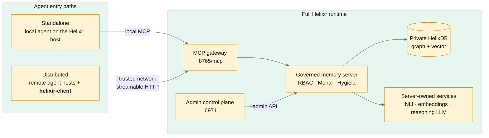
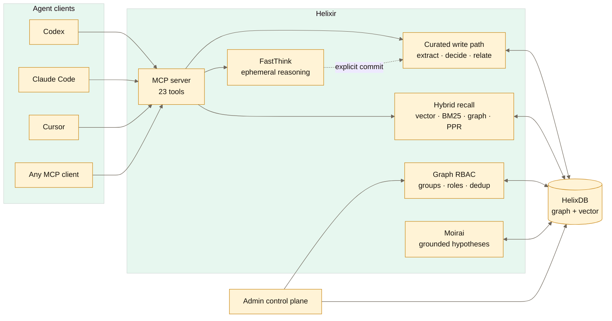
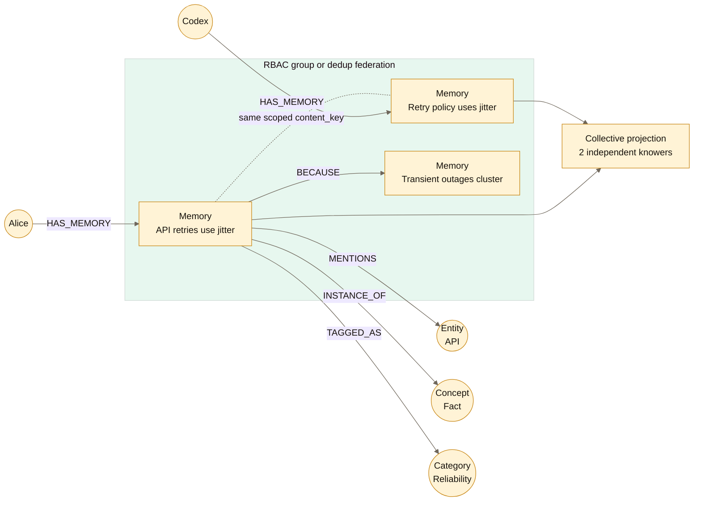

<p align="center">
  
</p>

<h1 align="center">Helixir</h1>

<p align="center">
  <strong>A governed, cross-harness memory control plane for AI agents.</strong><br />
  One persistent reasoning graph for Codex, Claude Code, Cursor, and every MCP-compatible client.
</p>

<p align="center">
  <a href="https://github.com/nikita-rulenko/Helixir/releases/tag/v0.17.0"></a>
  
  
  
  <a href="LICENSE"></a>
</p>

---

## Contents

- [Quick Start](#quick-start)
  - [Full Helixir host](#full-helixir-host)
  - [Remote agent host](#remote-agent-host)
- [Deployment topologies](#deployment-topologies)
- [What Helixir is](#what-helixir-is)
  - [Why it exists](#why-it-exists)
- [How the memory works](#how-the-memory-works)
  - [What is actually in the graph](#what-is-actually-in-the-graph)
- [Flashbacks: graph memory across time](#flashbacks-graph-memory-across-time)
- [Capabilities](#capabilities)
- [Governed collaboration](#governed-collaboration)
- [Admin control plane](#admin-control-plane)
- [Documentation](#documentation)
- [Development](#development)
- [License](#license)
- [Links](#links)

Helixir is the persistent epistemic layer an agent keeps when the model,
editor, session, or entire agent harness changes. It extracts durable facts
from conversations, preserves authorship, connects facts with typed reasoning
edges, and recalls both an answer and the path that supports it. When a dated
search touches older or newer connected knowledge, Helixir brings that context
back as an explicitly dated **flashback** instead of losing the connection or
silently corrupting the requested timeline.

An agent harness such as Codex or Claude Code owns the execution loop, tools,
workspace and model interaction. Helixir does not replace that runtime. It
provides a shared **memory data plane** and **governance control plane** that
multiple harnesses can use without surrendering provenance, access boundaries
or history.

It is built for teams as well as individual agents. Permanent graph-backed RBAC
keeps memories inside their groups, while explicit dedup federations let trusted
groups share consensus without leaking knowledge across boundaries.

## Quick Start

Choose the package by what this machine owns:

| This host | Install | Result |
|:----------|:--------|:-------|
| Runs Helixir itself | `helixir` | HelixDB topology, mandatory NLI and embeddings, gateway, RBAC, operations, and optional admin UI |
| Runs only an AI agent | `helixir-client` | One small bootstrapper pointed at an existing Helixir MCP gateway; no database, models, daemon, or UI |

### Full Helixir host

The portable installer selects the signed artifact for the current machine and
opens the guided onboarding flow:

```bash
curl -fsSL https://raw.githubusercontent.com/nikita-rulenko/Helixir/main/install.sh | bash
```

Or install the native package first:

```bash
# macOS or Linuxbrew
brew install nikita-rulenko/tap/helixir

# Debian 12 / Ubuntu 22.04+ after adding the signed Helixir repository
sudo apt install helixir
```

Then converge the database, models, MCP clients, RBAC, and optional admin UI:

```bash
helixir onboard
helixir doctor --json
```

For Codex, Claude Code, and Cursor, use one managed MCP gateway per host instead
of allowing every retained tool session to own a separate stdio process:

```bash
helixir gateway start --bind 127.0.0.1:8765
helixir setup --gateway 127.0.0.1:8765
```

The setup command backs up conflicting client configuration, replaces the
`helixir-local` entry only after explicit gateway selection, and verifies the
result. Stdio remains available as a compatibility transport.

Onboarding detects Codex, Claude Code, and Cursor, registers `helixir-local`,
installs the canonical Agent Skill, and verifies a real embedding request. The
default local path provisions mandatory NLI plus Ollama and
`nomic-embed-text`; an explicit remote embedding endpoint is also supported.

After onboarding, restart the agent client once and ask it to recall Helixir
memory. Global administrators can open the control plane at
`http://127.0.0.1:6971`.

### Remote agent host

Install only the thin client. The Homebrew and APT packages contain the same
independent client payload:

```bash
# macOS or Linuxbrew
brew install nikita-rulenko/tap/helixir-client

# or Debian 12 / Ubuntu 22.04+ after adding the signed Helixir repository
sudo apt install helixir-client

helixir-client connect \
  --gateway helixir-host.example:8765 \
  --principal codex-laptop \
  --owner codex \
  --project "$PWD"
helixir-client doctor
```

The client performs a real MCP handshake, admits a new principal only as
`worker` in reserved `onboarding`, registers `helixir-local` in selected
Codex/Claude Code/Cursor clients, and installs both the canonical memory skill
and a managed, backup-safe `AGENTS.md` block. Reconnecting is idempotent and
never downgrades roles assigned later by an administrator.

The endpoint is the Helixir **MCP gateway** (`8765/mcp` by default), never the
HelixDB database port (`6970` in this deployment). The gateway must already be
running on the Helixir host and reachable through the trusted network; set
`HELIXIR_GATEWAY_TOKEN` on the client when the server requires bearer auth.

> The Homebrew lifecycle, APT repository setup, signing-key fingerprint,
> headless flags, three HelixDB topology choices, source builds, upgrades, and
> uninstall guarantees live in the [installation guide](helixir/doc/installation.md).

## Deployment topologies

One full `helixir` host can serve a local agent or many remote agent-only hosts
bootstrapped by the independent `helixir-client` package.


```mermaid
%%{init: {"theme":"base","themeVariables":{"primaryColor":"#fff3d6","primaryTextColor":"#17130d","primaryBorderColor":"#c88613","lineColor":"#6f675b","secondaryColor":"#eee9ff","tertiaryColor":"#e7f7ef","fontFamily":"Inter, ui-sans-serif, system-ui"}}}%%
flowchart LR
    subgraph AgentPaths["Agent entry paths"]
        direction TB
        Local["Standalone<br/>local agent on the Helixir host"]
        Remote["Distributed<br/>remote agent hosts + <b>helixir-client</b>"]
    end

    subgraph ServerHost["Full Helixir runtime"]
        direction TB
        Gateway["MCP gateway<br/>:8765/mcp"]
        Core["Governed memory server<br/>RBAC · Moirai · Hygieia"]
        DB[("Private HelixDB<br/>graph + vector")]
        Services["Server-owned services<br/>NLI · embeddings · reasoning LLM"]
        UI["Admin control plane<br/>:6971"]

        Gateway --> Core
        UI -->|"admin API"| Core
        Core --> DB & Services
    end

    Local -->|"local MCP"| Gateway
    Remote -->|"trusted network<br/>streamable HTTP"| Gateway
```

`helixir` owns the database, models, RBAC, gateway, operations, backups and UI.
`helixir-client` only installs the remote host's MCP registration, canonical
skill and managed instructions. Remote agents use the gateway over the trusted
network and never connect directly to HelixDB.

## What Helixir is

| Helixir is | Helixir is not |
|:-----------|:---------------|
| A typed knowledge graph of atomic facts | A transcript or chat-history archive |
| A curated write path that can add, update, supersede, contradict, or link | An append-only vector bucket |
| Hybrid recall: dense vectors + BM25 + graph traversal + PPR | A generic RAG framework |
| Persistent memory plus an isolated FastThink scratchpad | A place where every intermediate thought is saved |
| A cross-harness memory data plane and governance control plane | A replacement for the agent's execution loop, tools, or sandbox |
| Shared memory governed by HelixDB-backed RBAC | A per-user silo or a local JSON ACL |
| A fixed eight-type user-facing ontology | A runtime-extensible RDF/OWL taxonomy |
| A memory and operations control plane for cooperative agents | An identity provider for an untrusted public network |

### Why it exists

Models are replaceable; accumulated reasoning is not. A graph grown over months
contains decisions, corrections, preferences, expertise, causal chains, and
disagreement history that no single model checkpoint owns. Helixir makes that
graph portable across agents and keeps it useful instead of letting it become a
pile of similar text.

Three principles shape the system:

1. **History is preserved.** Agents cannot hard-delete memory. New facts
   supersede old ones, and the old reasoning trail stays reachable.
2. **The writer pays, the reader flies.** Extraction and relation inference
   happen on write. Reads make no generative/reasoning-LLM calls; cold semantic
   queries only use the configured embedding endpoint.
3. **The memory does not gaslight its owner.** Dangerous contradictions and
   preference reversals are surfaced through the human-editable
   [memory charter](helixir/memory-charter.md), never silently overwritten.

The longer design argument is in
[Design rationale](helixir/doc/design-rationale.md).

## How the memory works


```mermaid
%%{init: {"theme":"base","themeVariables":{"primaryColor":"#fff3d6","primaryTextColor":"#17130d","primaryBorderColor":"#c88613","lineColor":"#6f675b","secondaryColor":"#eee9ff","tertiaryColor":"#e7f7ef","fontFamily":"Inter, ui-sans-serif, system-ui"}}}%%
flowchart LR
    subgraph Clients["Agent clients"]
        Codex["Codex"]
        Claude["Claude Code"]
        Cursor["Cursor"]
        Other["Any MCP client"]
    end

    subgraph Helixir["Helixir"]
        MCP["MCP server<br/>23 tools"]
        Write["Curated write path<br/>extract · decide · relate"]
        Read["Hybrid recall<br/>vector · BM25 · graph · PPR"]
        Think["FastThink<br/>ephemeral reasoning"]
        Policy["Graph RBAC<br/>groups · roles · dedup"]
        Moirai["Moirai<br/>grounded hypotheses"]
    end

    DB[("HelixDB<br/>graph + vector")]
    Admin["Admin control plane"]

    Codex & Claude & Cursor & Other --> MCP
    MCP --> Write & Read & Think
    Write & Read & Policy & Moirai <--> DB
    Think -. "explicit commit" .-> Write
    Admin --> Policy
    Admin --> DB
```

Every `add_memory` input is split into atomic facts and classified as one of
eight stable types: `fact`, `preference`, `skill`, `goal`, `opinion`,
`experience`, `achievement`, or `action`. The decision matrix then chooses
`ADD`, `UPDATE`, `SUPERSEDE`, `CONTRADICT`, `LINK_EXISTING`,
`CROSS_CONTRADICT`, `NOOP`, or a charter-governed `DELETE` conversion.

Recall fuses vector and keyword seeds, expands a bounded graph neighbourhood,
and ranks it with Personalized PageRank. Results retain provenance: direct
match, incoming edge, parent node, graph score, event time, and supersession
state.

### What is actually in the graph


```mermaid
%%{init: {"theme":"base","themeVariables":{"primaryColor":"#fff3d6","primaryTextColor":"#17130d","primaryBorderColor":"#c88613","lineColor":"#6f675b","secondaryColor":"#eee9ff","tertiaryColor":"#e7f7ef","fontFamily":"Inter, ui-sans-serif, system-ui"}}}%%
flowchart LR
    Alice(("Alice")) -->|HAS_MEMORY| M1["Memory<br/>API retries use jitter"]
    Codex(("Codex")) -->|HAS_MEMORY| M2["Memory<br/>Retry policy uses jitter"]

    subgraph Domain["RBAC group or dedup federation"]
        M1
        M2
        Cause["Memory<br/>Transient outages cluster"]
    end

    M1 -. "same scoped content_key" .- M2
    M1 -->|BECAUSE| Cause
    M1 -->|MENTIONS| API(("Entity<br/>API"))
    M1 -->|INSTANCE_OF| Fact(("Concept<br/>Fact"))
    M1 -->|TAGGED_AS| Reliability(("Category<br/>Reliability"))
    M1 & M2 --> Consensus["Collective projection<br/>2 independent knowers"]
```

The deployed v0.17 storage contract declares **22 node types**, **30 edge types**,
**5 vector indexes**, and **182 HQL queries**. These numbers describe
the complete physical schema, not 57 runtime-active capabilities: some entries
are explicitly reserved and have no live producer. `HAS_MEMORY` records provenance;
`MEMORY_IN_RBAC_GROUP` controls visibility. Equivalent author memories share a
security-scoped fingerprint rather than becoming one globally mutable node.
See the [data model](helixir/doc/data-model.md) for the active/reserved inventory.

## Flashbacks: graph memory across time

Most memory systems make an awkward choice: either a time filter hides every
useful fact outside the requested period, or retrieval ignores the filter and
mixes unrelated dates into one answer. Helixir keeps the timeline strict
without cutting the reasoning graph.

When an agent asks, for example, “what happened with rollouts in June?”, it can
pass an inclusive `time_from`/`time_to` event-time window to `search_memory`:

```text
search_memory(
  actor_id="codex",
  user_id="Codex",
  query="rollout failures",
  time_from="2026-06-01",
  time_to="2026-06-30"
)
```

The window uses event time (`valid_from` when present, otherwise the stored
creation time), not the moment the search runs. Direct seed results must come
from June. Authorized graph traversal may still discover a connected cause,
consequence, contradiction, or supporting fact from outside June. Helixir
returns that row separately as a flashback with `metadata.flashback=true` and
its real `metadata.event_date`.

| Result | Example | How the agent presents it |
|:-------|:--------|:--------------------------|
| In-window memory | June 18: rollout failed | “During June, the rollout failed.” |
| Graph-linked flashback | May 12: token rotation policy changed | “Related context from May 12: the token policy changed.” |

Flashbacks use their own bounded allowance (`retrieval.flashback_max`, default
`3`), so they never displace the requested period's direct results. RBAC still
applies before and after traversal, and the flashback is recovered from stored
graph relations without a generative/reasoning-LLM call on the read path. It is
an association across time—not a claim that the linked event happened inside
the requested window.

The exact caller and projection contract is documented in
[Event-time windows and flashbacks](helixir/doc/userflow.md#event-time-windows-and-flashbacks).

## Capabilities

| Surface | What it provides |
|:--------|:-----------------|
| Persistent memory | Atomic extraction, dedup, supersession, contradictions, entities, ontology, raw-source preservation |
| Reasoning graph | `BECAUSE`, `IMPLIES`, `SUPPORTS`, `CONTRADICTS`, `RELATES_TO`, `PART_OF`, `IS_A` |
| Retrieval | Recent/contextual/deep/full modes, personal/collective scopes, [event-time windows and dated flashbacks](#flashbacks-graph-memory-across-time) |
| FastThink | Branching in-memory scratchpad; only an explicit conclusion enters long-term memory |
| Hive consensus | Independent authorship collapsed inside one RBAC group or explicit dedup federation |
| Moirai | Clotho categories, Lachesis routes, Atropos hypotheses with admin-only witness provenance |
| Hygieia | Database, model, storage, process, memory-pressure, and backup health supervision |
| Administration | Users, agents, groups, roles, dedup federations, graph explorer, settings, operations, backup vault |
| Distribution | Signed native archives, Homebrew tap, signed APT repository, and multi-architecture containers |

The MCP server exposes 23 tools, two prompts, and three resources. Start with
`search_memory` for recall, `add_memory` for durable knowledge,
`search_reasoning_chain` for “why”, `connect_memories` for paths, and the seven
`think_*` tools for complex working reasoning. The complete selection guide is
in [Agent and MCP userflow](helixir/doc/userflow.md).

## Governed collaboration

RBAC is permanently enabled and stored in HelixDB—the same graph that stores
the protected memories. Authorization is deny-by-default and fails closed.

| Role | Scope |
|:-----|:------|
| `admin` | Global memory and policy administration; the only role allowed into the web UI and Moirai system layer |
| `groupadmin` | Read/write plus membership and role management in assigned non-reserved groups |
| `moderator` | Read/write assigned groups and group members' memories |
| `worker` | Read assigned groups; write only under own authorship |
| `viewer` | Read-only in assigned groups |

Reserved workspaces establish safe defaults:

- `default` preserves pre-RBAC shared knowledge for trusted legacy peers;
- `onboarding` admits newly discovered principals before normal assignment;
- `moirai` holds generated hypotheses and provenance for global admins only.

Groups deduplicate independently unless an administrator explicitly joins them
to a dedup federation. Leaving a federation preserves historical visibility but
isolates future writes. See [RBAC and operations](helixir/doc/operations.md).

> Helixir RBAC separates cooperative principals; it does not authenticate an
> arbitrary malicious caller by itself. Keep the default gateway in a trusted
> network or enable its bearer-token boundary.

## Admin control plane

The browser UI is deliberately **global-admin-only**. It ships as a separate
read-only, non-root container with no Docker socket and no host-home mount. A
narrow token-authenticated native supervisor owns the allowlisted host
operations.

From one surface an administrator can inspect live memory/node/agent counts,
explore the category-first graph, manage RBAC and dedup federations, follow the
Moirai evidence journal, inspect Hygieia health, change redacted settings, and
create or restore guarded managed-database backups.

```bash
helixir control-plane status
helixir control-plane install
helixir control-plane uninstall
```

## Documentation

The root README is the product tour. Maintained reference material lives under
[`helixir/doc/`](helixir/doc/README.md):

| Read this | When you need |
|:----------|:--------------|
| [Installation](helixir/doc/installation.md) | Homebrew/APT setup, source builds, prerequisites, topology choices, models, clients, upgrades |
| [Operations](helixir/doc/operations.md) | CLI, RBAC administration, gateway, configuration, control plane, backups, development commands |
| [Design rationale](helixir/doc/design-rationale.md) | What Helixir is, what it rejects, and why the load-bearing decisions exist |
| [Architecture](helixir/doc/architecture.md) | Layers, components, boundaries, ownership, and capability surface |
| [Data model](helixir/doc/data-model.md) | Nodes, edges, vectors, ontology, RBAC graph, and migration discipline |
| [Dataflow](helixir/doc/dataflow.md) | End-to-end write, search, and FastThink pipelines |
| [Agent userflow](helixir/doc/userflow.md) | MCP tools, prompts, resources, identities, and typical sessions |
| [Test design](helixir/doc/test-design.md) | Coverage map, E2E gates, and known integrity risks |
| [Glossary](GLOSSARY.md) | Project vocabulary: PPR, RRF, Hive, Moirai, charter, provenance |
| [Upgrading](UPGRADING.md) | Version-by-version operational migration notes |
| [v0.17.0 notes](helixir/doc/v0.17.0/notes.md) | What changed in this release |

Historical audits and previous release snapshots remain frozen inside
`helixir/doc/`; they are evidence, not current instructions.
The [capability map](helixir/doc/README.md#capability-map) is the shortest route
from a product feature to its maintained contract.

## Development

```bash
git clone https://github.com/nikita-rulenko/Helixir.git
cd Helixir
make build
make check
make test
```

Helixir targets Rust 2024 and **Helix CLI v2.3.5**. HelixDB v3/hyperscale is a
different engine and cannot build this schema. Read the
[installation prerequisites](helixir/doc/installation.md#prerequisites) before
running schema commands.

Contribution rules live in [AGENTS.md](AGENTS.md). Architecture changes must
update the matching evergreen document in the same change.

## License

[MIT](LICENSE) © 2025–2026 Nikita Rulenko

## Links

- [HelixDB](https://github.com/HelixDB/helix-db) — graph + vector database
- [Model Context Protocol](https://modelcontextprotocol.io/) — agent integration protocol
- [Releases](https://github.com/nikita-rulenko/Helixir/releases) — signed artifacts and checksums
- [Issues](https://github.com/nikita-rulenko/Helixir/issues) — bugs, roadmap, and release evidence
