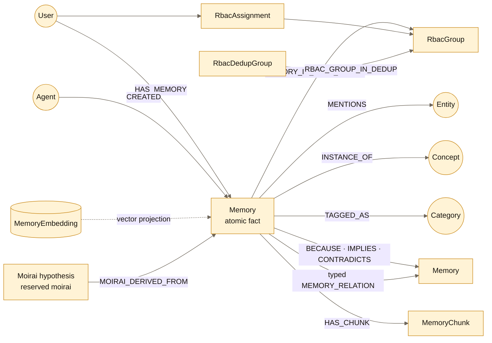

# Data model (datadesign)

> _Reflects code as of `v0.16.0`. Last verified: 2026-08-19._

Authoritative source: `helixir/schema/schema.hx` (node + edge definitions)
and `helixir/schema/queries.hx` (180 HQL queries that materialize the
contract). Anything below disagreeing with those files is the bug.

## 1. Storage at a glance

The diagram is the active conceptual core, not a substitute for the complete
node/edge tables below.



The complete store contains **22 node types**, **5 vector-index types**, **30
edge types**, and **180 named HQL queries**. The default embedding dimension is
768.

There is no relational database or Redis. Every durable memory, reasoning,
identity and RBAC fact lives in HelixDB. Host-local configuration, operation
journals, model files and recovery archives are operational state, not a second
knowledge or authorization store.

## 2. Node taxonomy

Nodes group into identity, content, semantics, reasoning, vector-index,
authorization, category, and reserved document-pipeline purposes.

| Node | Key fields | Notes |
|---|---|---|
| **User** | `user_id`, `name`, `email`, `created_at`, `metadata` | One per identity. |
| **Agent** | `agent_id`, `role`, `capabilities`, `agent_version`, `host`, `last_seen`, `status` | Tracks writers and doubles as the swarm presence record: MCP initialization grants the configured `HELIXIR_RBAC_ACTOR` one bounded lease, real tool activity refreshes it, `add_memory(agent_id=…)` refreshes a distinct worker identity, and `swarm_status` reads the roster. |
| **Session** | `session_id`, `started_at`, `ended_at`, `status`, `session_type` | Reserved — no code path creates Sessions yet. |
| **Memory** | `memory_id`, `content_key`, `rbac_scope`, `user_id`, `content`, `memory_type`, `certainty`, `importance`, `created_at/updated_at`, `valid_from/until`, `immutable`, `verified`, `context_tags`, `source`, `metadata`, `is_deleted/deleted_at/deleted_by`, `user_count` | Core unit. `content_key` and `rbac_scope` keep Hive consensus inside its security domain. |
| **RbacGroup** | `group_id`, `name`, `description`, `active` | Concrete access group. |
| **RbacDedupGroup** | `dedup_group_id`, `name`, `description`, `active` | Optional federation whose current groups share dedup and new-memory visibility. |
| **RbacAssignment / RbacConfig** | subject/role/group audit fields; enabled flag | HelixDB-backed authorization source of truth. |
| **MemoryChunk** | `chunk_id`, `position`, `parent_memory_id`, `content`, `token_count` | Oversized-source storage and reconstruction only. Extracted atomic memories, not chunks, are retrieval units (#86). |
| **Entity** | `entity_id`, `name`, `entity_type`, `properties`, `aliases` | LLM-extracted, deduplicated by name/aliases. |
| **Concept** | `concept_id`, `name`, `level`, `description`, `parent_id`, `properties` | Ontology node. `parent_id` denormalizes the `IS_A` edge — see §6. |
| **Context** | `context_id`, `name`, `context_type`, `properties`, `parent_context` | "work", "personal", custom scopes. |
| **Constraint** | `constraint_id`, `rule`, `constraint_type`, `priority`, `active` | Reserved (planned for VALID_IN gating). |
| **Reasoning** | `reasoning_id`, `reasoning_type`, `description`, `confidence` | Reified reasoning step. |
| **HistoryEvent** | `event_id`, `memory_id`, `action`, `old_value`, `new_value`, `timestamp`, `actor` | Audit trail. |
| **MemoryEmbedding** | `content` (proj.), `created_at` | Vector index for memories. |
| **EntityEmbedding** | `name` | Vector index for entities. |
| **ChunkEmbedding** | `embedding: [F64]` | Vector for `DocChunk` (reserved doc pipeline; memory chunks are deliberately NOT embedded — #86). |
| **ConceptEmbedding** | `embedding: [F64]` | Vector for concept search (reserved). |
| **DocPage / DocChunk / CodeExample / ErrorCode** | — | Reserved doc-ingest pipeline. Schema present, no Rust producer. |

### 2.1 Category subgraph (Clotho, 2026-06)

The controlled-vocabulary substrate the Moirai route over (`d8edc85`). A
deliberate **third axis** over the flat memory graph: a memory's category
membership lets it bridge to distant memories that share it.

| Artifact | Shape | Notes |
|---|---|---|
| **Category** node | `category_id`, `name` (normalized, English-canonical), `kind`, `description`, `created_at` | Dictionary entry. Seeded by `Clotho::seed_dictionary`. |
| **CategoryEmbedding** node | `name` | Vector for embedding-match tagging. *Reserved* — Clotho v0 matches by in-memory cosine (SearchV exposes no readable score), so no producer wires this yet. |
| `TAGGED_AS` edge | Memory → Category, `{confidence, source}` | The tag. `Clotho::auto_tag` (`source="clotho-embed"`). |
| `SUBCATEGORY_OF` edge | Category → Category | Persisted hierarchy. Clotho/tooling writes it; current query-time ancestor propagation still uses the in-memory seed table. |
| `ALIAS_OF` edge | Category → Category | Synonyms (collapses "raw material"/"сырьё"); Clotho writes canonical aliases at mint time. |
`CategoryEmbedding` is a reserved vector type without a graph edge in the
current schema. Clotho embeds category names in process for matching; it does
not persist category vectors yet.

Routing reads: `getMemoryCategories`, `getMemoriesByCategory` (membership +
global-admin-only cross-domain bridge in `connect_memories`); `category_member_ids` feeds
Lachesis PMI subset-overlap (`ln(\|A∩B\|·N / (\|A\|·\|B\|))`). The planned
`Category —CO_OCCURS{count, pmi}→ Category` edge + `Insight` journal nodes are
the next schema step (persists what PMI v0 computes on the fly).

## 3. Edge taxonomy

```
   IDENTITY                CONTENT                     SEMANTICS
   ────────                ────────                    ─────────
   User HAS_MEMORY ───►Memory◄─── HAS_CHUNK ── MemoryChunk
                          │                       │
                          │ MENTIONS ─────────► Entity
                          │ EXTRACTED_ENTITY ─► Entity
                          │ INSTANCE_OF ──────► Concept
                          │ TAGGED_AS ────────► Category
                          │ VALID_IN ─────────► Context
                          │                       │
                          │ HAS_EMBEDDING ────► MemoryEmbedding
   Agent AGENT_CREATED ──►│                       │
                          │ HAS_HISTORY ──────► HistoryEvent
                          │                       │
   REASONING (Memory→Memory):  7 semantic types via dedicated + generic edges
   DECISION  (Memory→Memory):  SUPERSEDES · CONTRADICTS
```

### Memory→memory relations: seven semantics, two storage shapes

The reasoning API exposes seven typed memory↔memory relations. `IMPLIES`,
`BECAUSE`, and `CONTRADICTS` use dedicated physical edges. `SUPPORTS`,
`RELATES_TO`, `PART_OF`, and `IS_A` use `MEMORY_RELATION` with the semantic
type in `relation_type`. `search_reasoning_chain` and `get_memory_graph`
project the semantic type rather than requiring consumers to know the storage
shape.
(`src/toolkit/mind_toolbox/reasoning/types.rs`, `edges.rs`;
query `addMemoryRelation`.)

The **decision pipeline** additionally uses these dedicated edges:

| Edge | Properties | Created in |
|---|---|---|
| `SUPERSEDES` | `reason`, `superseded_at`, `is_contradiction` | decision verdict `SUPERSEDE` (`addMemorySupersession`) |
| `CONTRADICTS` | `resolution`, `resolved`, `resolution_strategy` | verdict `CONTRADICT` / cross-user contradiction (`addMemoryContradiction`); `resolved`/`resolution_strategy` are what the Atropos reconcile pass flips |

There is no dedicated `SUPPORTS` schema edge; support is deliberately stored
as `MEMORY_RELATION{relation_type="SUPPORTS"}`.

### Active edges

| Edge | From → To | Properties | Created in |
|---|---|---|---|
| `HAS_MEMORY` | User → Memory | `context`, `access_count` | `tooling_manager/add_pipeline/cross_user.rs`; consensus `user_count` derives from these (#54) |
| `INSTANCE_OF` | Memory → Concept | `confidence` | ontology mapping in add pipeline |
| `MENTIONS` | Memory → Entity | `salience`, `sentiment` | entity manager |
| `EXTRACTED_ENTITY` | Memory → Entity | `confidence`, `method` | extractor output |
| `RELATES_TO` | Entity → Entity | `relationship_type`, `strength`, `bidirectional` | extractor relations |
| `VALID_IN` | Memory → Context | `priority`, `exclusive` | `add_pipeline/context_link.rs` (creates the Context on miss) |
| `AGENT_CREATED` | Agent → Memory | `timestamp`, `method` | tooling helpers — ensure-then-link: the Agent node is auto-created on first sight |
| `HAS_HISTORY` | Memory → HistoryEvent | — | every UPDATE/SUPERSEDE/DELETE |
| `HAS_CHUNK` | Memory → MemoryChunk | `chunk_index` | chunking manager |
| `MEMORY_RELATION` | Memory → Memory | `relation_type`, `strength`, `created_at`, `metadata` | `SUPPORTS` plus associative relations — see above |
| `IMPLIES` / `BECAUSE` | Memory → Memory | probability/strength + reasoning id | reasoning engine and contradiction reconciliation |
| `SUPERSEDES` / `CONTRADICTS` | Memory → Memory | see above | decision/reasoning engines — see above |
| `HAS_EMBEDDING` | Memory → MemoryEmbedding | `embedding_model` | add pipeline |
| `HAS_SUBTYPE` | Concept → Concept | — | ontology loader (seed; self-healing against duplicate trees, #67) |
| `TAGGED_AS` | Memory → Category | `confidence`, `source` | `Clotho::auto_tag` (§2.1) |
| `SUBCATEGORY_OF` / `ALIAS_OF` | Category → Category | — | category tooling / Clotho vocabulary convergence |
| `MOIRAI_DERIVED_FROM` | Memory → Memory | `source`, `created_at` | Admin-only generated hypothesis → source-memory provenance; not traversed by ordinary reasoning/search |
| `RBAC_MEMBER_OF` | User → RbacGroup | role/grant metadata | RBAC assignment service |
| `MEMORY_IN_RBAC_GROUP` | Memory → RbacGroup | assignment audit | write path and migration; materialized visibility boundary |
| `RBAC_GROUP_IN_DEDUP_GROUP` | RbacGroup → RbacDedupGroup | assignment audit | federation administration |
| `MEMORY_IN_RBAC_DEDUP_GROUP` | Memory → RbacDedupGroup | assignment audit | write path; persisted dedup provenance |

### Reserved edges

Schema-declared and HQL-ready, but not written by a live product flow:

- `CREATED_IN` (Memory→Session): helper/query exists, but Session creation is
  not wired;
- `IS_A` and `CONCEPT_RELATED_TO` (Concept→Concept): reserved internal
  representation for the fixed ontology, not runtime ontology extension;
- `PART_OF` (Entity→Entity): helper/query exists, while current extraction
  persists typed entity `RELATES_TO` edges;
- `ENTITY_HAS_EMBEDDING`: query exists for a future persisted entity-resolution
  index, but no Rust caller writes it;
- `CHUNK_TO_EMBEDDING`: belongs only to the reserved documentation pipeline.
  `MemoryChunk` deliberately has no vector edge.

The schema contains exactly 30 edge declarations. Names from older releases
such as `BELONGS_TO_CATEGORY`, `NEXT_CHUNK`, `OCCURRED_IN`, `IN_SESSION`,
`APPLIES_IN`, `CHUNK_MENTIONS_CONCEPT`, `CONCEPT_HAS_EXAMPLE`, and
`ERROR_REFERENCES_CONCEPT` are historical and are not part of the current
contract.

## 4. Ontology hierarchy (instances of `Concept`)

```
Thing
 ├── Attribute
 │     ├── Fact
 │     ├── Preference
 │     ├── Skill
 │     ├── Goal
 │     ├── Opinion
 │     └── Trait
 ├── Event
 │     ├── Action
 │     ├── Experience
 │     └── Achievement
 ├── Entity
 │     ├── Person
 │     ├── Organization
 │     ├── Location
 │     ├── Object
 │     └── Technology
 ├── Relation
 └── State
```

Loaded once at process boot (`ToolingManager::initialize` →
`OntologyManager::load`). Held in an in-process map; HelixDB is the persistent
copy, but reads at runtime hit the in-memory cache.

The 8 user-facing concept types referenced by `search_by_concept` map to the
leaves under `Attribute` and `Event`: `skill, preference, goal, fact, opinion,
experience, achievement, action`.

## 5. Invariants

These are the assumptions the rest of the code relies on. Violating any of
them is a data-integrity bug.

1. **Memory.user_id is non-empty** for every Memory reachable from `HAS_MEMORY`.
   Schema declares `DEFAULT ""` — see §6 issue #12.
2. **HAS_EMBEDDING is 1:1.** Every Memory has at most one MemoryEmbedding.
   Enforced only by convention; no DB constraint.
3. **SUPERSEDES is acyclic.** The decision engine relies on chasing
   `SUPERSEDES` edges backward to find the live memory.
4. **HAS_CHUNK positions are ordered and unique per memory.** Memory chunks
   are reconstructed by their stored position; the current schema has no
   chunk-to-chunk edge.
5. **INSTANCE_OF points to an `Attribute`-subtree or `Event`-subtree leaf.**
   The mapper rejects non-leaf classifications.
6. **CONTRADICTS is symmetric in intent.** Code writes a single directed edge;
   queries that walk contradictions handle both directions.
7. **Hive Memory:** `Memory.user_count` is monotone non-decreasing for any
   given `memory_id`.

## 6. Schema patterns to recognize

These are recurring shapes in `schema.hx` that affect how Rust code reads and
writes the data. Tracked variants of these patterns may have open issues —
listed here so contributors recognize them without re-deriving from grep.

- **Booleans encoded as `I64`.** `immutable`, `verified`, `is_deleted`,
  `active`, `resolved`, `bidirectional`, `exclusive`. HelixDB has no `Bool`
  type; convention is `0 = false, 1 = true`.
- **Identity fields with `DEFAULT ""`.** `Memory.user_id`, `Memory.deleted_at`,
  `Memory.deleted_by`. An insert without `user_id` is legal at the schema
  level and produces a node with empty `user_id`.
- **JSON-in-string.** `Memory.metadata`, `Entity.properties`, `Entity.aliases`,
  `Concept.properties` are `String` columns holding serialized JSON. No
  schema validation; every read pays a JSON parse.
- **Time-type variation.** `Memory.created_at` is `String DEFAULT
  "{{timestamp}}"`, while `MemoryEmbedding.created_at` is `Date`.
- **Denormalized parent links.** `Concept.parent_id: String` exists alongside
  the `IS_A` edge.
- **`smart_traversal` module name.** The `_v2` suffix is a naming artifact
  from an earlier `smart_traversal` that was removed; the current module is
  the only implementation.

## 7. Migration approach (for future schema changes)

There is no arbitrary per-tag data-migration framework today. For a manual
schema change, the low-level playbook is:

1. Edit `schema.hx` and `queries.hx`.
2. Run `helixir-deploy --host … --port … --schema-dir helixir/schema`.
3. HelixDB accepts the new schema but does not migrate existing data;
   adding a non-nullable field to a populated node is therefore not safe.

The v0.16 installer does provide a higher-level **transactional deployment
orchestrator** for a Helixir-managed local database: it identifies ownership,
takes and verifies a cold backup before schema deployment, resumes an
interrupted plan, and verifies the live contract afterwards. That safety layer
does not synthesize arbitrary data transformations and never assumes lifecycle
authority over an existing-local or remote database.

## 8. RBAC graph and compatibility bootstrap

RBAC is stored in HelixDB and is the single source of truth shared by the CLI,
MCP server, and library facade. `RbacGroup` names a team, while
`RbacAssignment` is an auditable grant (`subject_id`, `role`, `group_id`,
`active`, grant/revoke timestamps). `RBAC_MEMBER_OF` is the traversable
principal-to-group edge and `MEMORY_IN_RBAC_GROUP` links authored memories to
the groups active for their author. `RbacConfig` holds the enforcement switch,
the one-way phase (`pending`, `migrating`, `active`), and a once-chosen
`fresh|legacy` branch. The storage-level `enabled = 0` default exists only for
the pre-bootstrap checkpoint; there is no product-level disabled profile.
Bootstrap creates reserved `default`, `onboarding`, and `moirai`, verifies all grants and
legacy-memory edges, enables enforcement, and marks the transition active.
Failure leaves `migrating` in HelixDB so the next run resumes.

The `default` workspace intentionally stores an empty `Memory.rbac_scope` and
uses the legacy unsalted `content_key`, while `MEMORY_IN_RBAC_GROUP` supplies
the access boundary. Pre-RBAC principals receive equal group-admin rights there.
`onboarding`, `moirai`, custom groups, and dedup federations use salted security domains.
The membership-free `moirai` workspace holds first-class hypotheses generated
across groups. `MOIRAI_DERIVED_FROM` points from those hypotheses to source
memories but is omitted from ordinary reasoning traversal.

An active `RBAC_MEMBER_OF` edge into `onboarding` marks a new principal as
enrolled. Active or historical membership in either reserved workspace makes
the principal visible in the administrative registry. Revocation retains the
User node and `RbacAssignment` audit row; no second registry is persisted.

All three system workspaces are reserved: management APIs reject
deactivation and dedup-federation membership because either operation would
break the migration, registry, or legacy-fingerprint contract. Enabled policy
also rejects revocation of its last global administrator.

The existing `Memory.user_id` remains the author/owner and is never replaced by
a group id. Authorization resolves the actor's active assignments, derives the
groups and owners reachable through the graph, and then applies the role matrix:
global admin is unrestricted; group admin can read/write and manage roles in
one or more assigned non-reserved groups; moderator can read/write its groups; worker can write only
their own authored memories; viewer is read-only. Revocation deactivates the
assignment and preserves its audit history.

At the API boundary, `actor_id` is intentionally distinct from `Memory.user_id`:
the former is the principal being authorized, the latter is the owner whose
memory is read or written. Agent integrations must supply a stable actor id.
